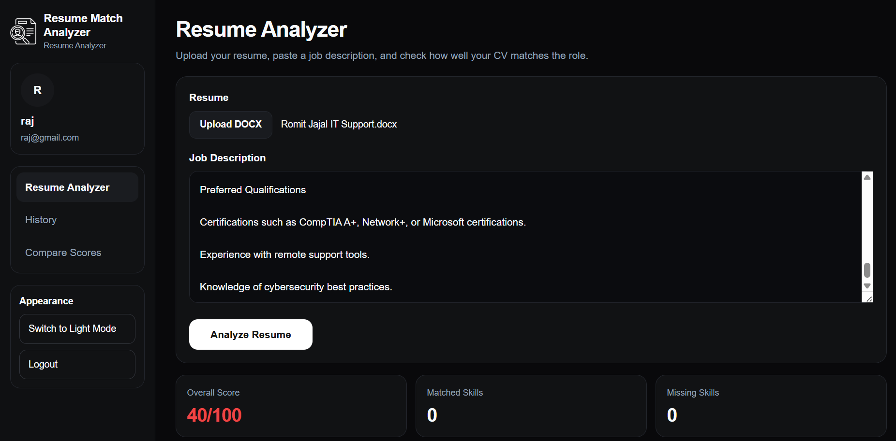
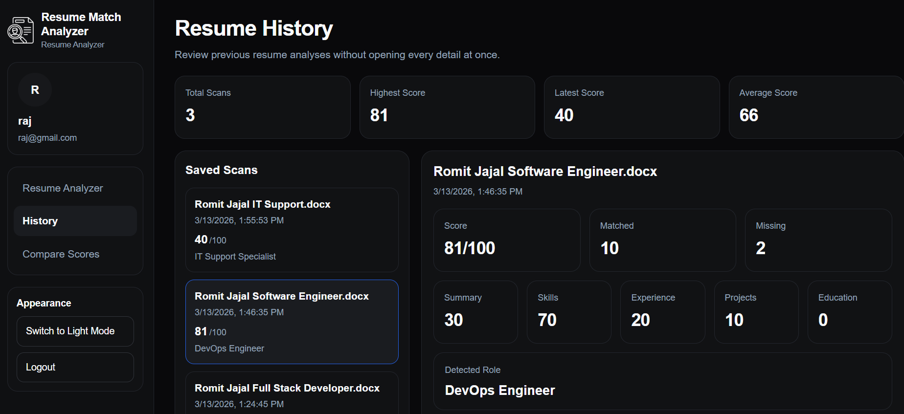

# Resume Match Analyzer

⭐ If you find this project interesting, feel free to star the repository.

An AI-powered web application that compares resumes with job descriptions and detects missing skills to improve job applications.

## Live Demo

https://resume-match-analyzer-2j26lyzdx-romitjajals-projects.vercel.app/login

## Features

• Resume keyword analysis
• Job description comparison
• Missing skills detection
• Resume match score calculation
• Resume history tracking
• Section-level scoring (skills, experience, projects, education)

## Tech Stack

Frontend
• Next.js
• TypeScript

Backend
• Next.js API Routes
• Prisma ORM

Database
• PostgreSQL (Neon)

Authentication
• JWT

Deployment
• Vercel

## Screenshots

## Screenshots

### Resume Analyzer

### Resume History

### Compare Scores

## Run Locally

Clone the repository

git clone https://github.com/Romitjajal/resume-match-analyzer

Install dependencies

npm install

Run the development server

npm run dev

## Author

Romit Jajal
