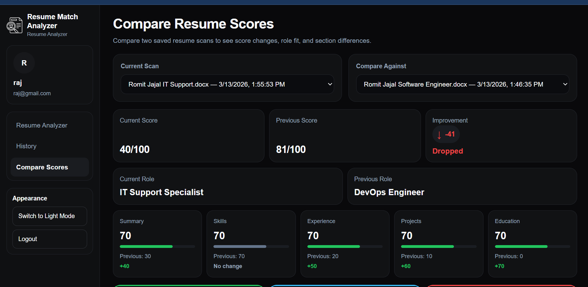

# AI Resume Copilot

AI-powered resume optimization platform built with Next.js, OpenAI, Prisma, and PostgreSQL.

This application analyzes resumes against job descriptions, detects missing skills, calculates ATS-style scores, and generates tailored resume improvements for specific roles.

⭐ If you find this project interesting, feel free to star the repository.

Live Application:
https://ai-cv-optimizer-pink.vercel.app/
## Features

- ATS-style resume analysis
- AI-powered resume tailoring
- Resume and job description comparison
- Missing skills detection
- Resume score calculation
- Section-level scoring
- Resume history tracking
- DOCX resume export
- JWT authentication
- OpenAI integration

## Tech Stack

### Frontend
- Next.js
- React
- TypeScript
- Tailwind CSS

### Backend
- Next.js API Routes
- Prisma ORM
- OpenAI API

### Database
- PostgreSQL (Neon)

### Authentication
- JWT

### Deployment
- Vercel

## Architecture

Frontend → API Routes → OpenAI Processing → PostgreSQL Storage → Resume Export

## Screenshots

### Resume Analyzer


### AI Tailored Resume Comparison


## Run Locally

Clone the repository

```bash
git clone https://github.com/Romitjajal/ai-resume-copilot
```

Install dependencies

```bash
npm install
```

Run the development server

```bash
npm run dev
```

## Author

Romit Jajal
